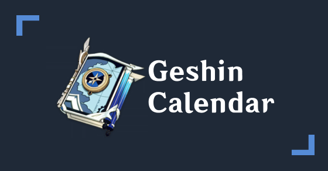
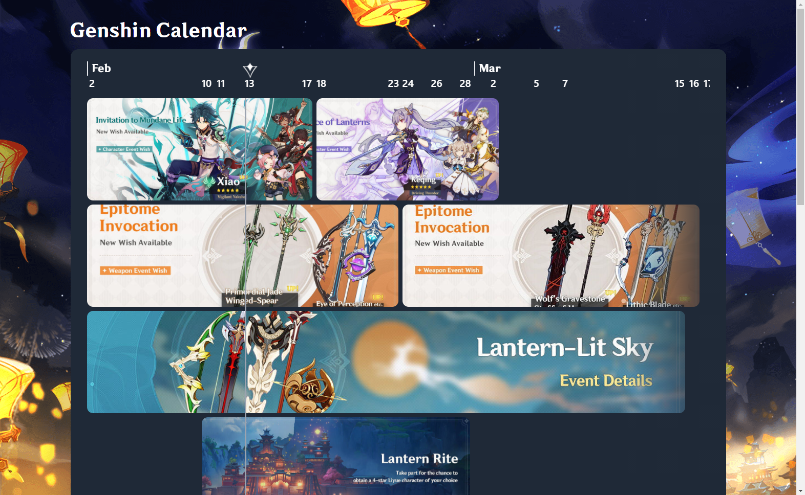

<p align="center">
  <a href="https://github.com/zernonia/genshin-calendar">
    
  </a>

  <h1 align="center">Genshin Calendar 📅</h1>

  <p align="center">
    Genshin Impact Calendar | Open-source Fan-made project to help you visualize all the Upcoming Event in Genshin Impact 
    <br />🔥💧💨⚡🍀❄🌎. 
    <br />
    <br /><strong>Feel free to contribute.</strong>
    <br />
    <br />
    <br />
    <a href="https://github.com/zernonia/genshin-calendar">View Source</a>
    ·
    <a href="https://github.com/zernonia/genshin-calendar/issues">Report Bug</a>
    ·
    <a href="https://github.com/zernonia/genshin-calendar/issues">Request Feature</a>
  </p>
</p>


<!-- TABLE OF CONTENTS -->
<details open="open">
  <summary><h2 style="display: inline-block">Table of Contents</h2></summary>
  <ol>
    <li>
      <a href="#about-the-project">About The Project</a>
      <ul>
        <li><a href="#built-with">Built With</a></li>
      </ul>
    </li>
    <li>
      <a href="#getting-started">Getting Started</a>
      <ul>
        <li><a href="#prerequisites">Prerequisites</a></li>
        <li><a href="#installation">Installation</a></li>
      </ul>
    </li>
    <li><a href="#usage">Usage</a></li>
    <li><a href="#roadmap">Roadmap</a></li>
    <li><a href="#contributing">Contributing</a></li>
    <li><a href="#license">License</a></li>
    <li><a href="#contact">Contact</a></li>
    <li><a href="#acknowledgements">Take Note</a></li>
  </ol>
</details>


<!-- ABOUT THE PROJECT -->
## About The Project



Here's a blank template to get started:
**To avoid retyping too much info. Do a search and replace with your text editor for the following:**
`zernonia`, `genshin-calendar`, `zernonia`, `zernonia@gmail.com`


### Built With

* [Vue 3](https://v3.vuejs.org/)
* [Vite](http://vitejs.dev/)
* [TailwindCSS](https://tailwindcss.com/)
* [Vercel - Deployment](https://vercel.com/)


<!-- GETTING STARTED -->
## Getting Started

To get a local copy up and running follow these simple steps.

### Prerequisites

This is an example of how to list things you need to use the software and how to install them.
* npm / yarn
  ```sh
  npm install npm@latest -g  # OR npm install yarn -g
  ```

### Installation

1. Clone the repo
   ```sh
   git clone https://github.com/zernonia/genshin-calendar.git
   ```
2. Install NPM packages
   ```sh
   npm install # OR yarn add
   ```
3. Run local development
   ```sh
   npm run dev # OR yarn dev
   ```


<!-- ROADMAP -->
## Roadmap

See the [open issues](https://github.com/zernonia/genshin-calendar/issues) for a list of proposed features (and known issues).


<!-- CONTRIBUTING -->
## Contributing

Contributions are what make the open source community such an amazing place to be learn, inspire, and create. Any contributions you make are **greatly appreciated**.

1. Fork the Project
2. Create your Feature Branch (`git checkout -b feature/AmazingFeature`)
3. Commit your Changes (`git commit -m 'Add some AmazingFeature'`)
4. Push to the Branch (`git push origin feature/AmazingFeature`)
5. Open a Pull Request


<!-- LICENSE -->
## License

Distributed under the MIT License. See `LICENSE` for more information.


<!-- CONTACT -->
## Contact

Zernonia - [@zernonia](https://twitter.com/zernonia) - zernonia@gmail.com

Project Link: [https://github.com/zernonia/genshin-calendar](https://github.com/zernonia/genshin-calendar)


<!-- ACKNOWLEDGEMENTS -->
## Take Note

**Genshin Calendar** is not affiliated with or endorsed by miHoYo. **Genshin Calendar** is a tools for visualizing Official Event for the Genshin Impact game for PC, Switch, Playstation 4, and mobile game app on iOS and Android.

